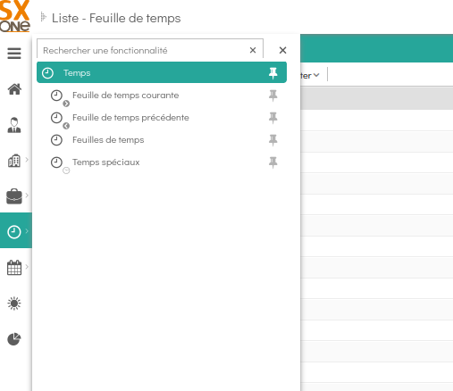
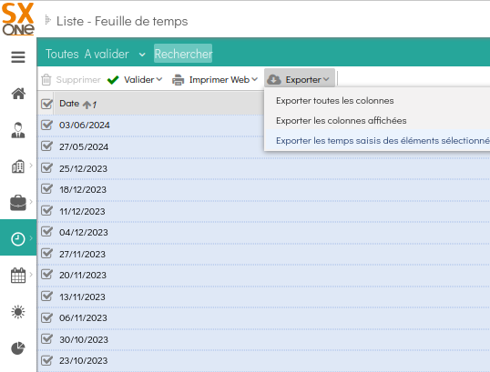

# SXONE ASSEMBLE!

Short python script for people tired of manually calculating their time tracking on SXONE.

# HOW TO

## Python

You need Python 3 installed, then you just run:

```bash
python sxone_assemble.py /path/export_everwin.xlsx [month] [year]
```

## Docker

You just need docker. Then you run:
Note that the mounted name of the file (/app/export.xlsx) is critical and must not be changed.

```bash
docker run -it --rm -v /path/export_everwin.xlsx:/app/export.xlsx sxone_assemble:latest [month] [year]
```

# Notes

All [month] values default to the current month if not specified  
All [year] values default to the current year if not specified. The [month] parameter is required is you want to specify the [year]

# Examples

```bash
python sxone_assemble.py /path/export_everwin.xlsx

python sxone_assemble.py /path/export_everwin.xlsx 11

python sxone_assemble.py /path/export_everwin.xlsx 5 2021
```

And it's docker equivalent

```bash
docker run -it --rm -v /path/export_everwin.xlsx:/app/export.xlsx sxone_assemble:latest

docker run -it --rm -v /path/export_everwin.xlsx:/app/export.xlsx sxone_assemble:latest 11

docker run -it --rm -v /path/export_everwin.xlsx:/app/export.xlsx sxone_assemble:latest 5 2021
```

# PREPARING THE CSV FILE

## FRENCH

Depuis le menu Temps, choisir Feuilles de temps.




Séléctionnez les feuilles qui vous intéressent (ou toutes, on s'en fiche), puis Exporter et "Exporter les temps saisis des éléments séléctionnés"



Et zou, si vous avez votre fichier dans votre répertoire standard de Téléchargements par exemple

```bash
docker run -it --rm -v %USERPROFILE%\Téléchargements\export_everwin.xlsx:/app/export.xlsx sxone_assemble:latest
```